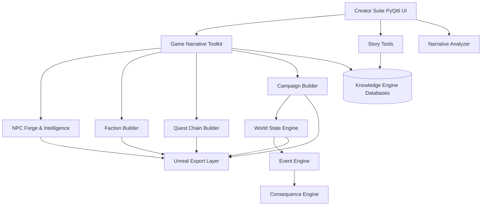

# StoryForge Architecture V1.0.0

StoryForge uses a modular, event-driven architecture designed to be extensible and export-friendly.

## Module Map

## Core Systems
1. **StoryForge Core (`modules/storyforge_core/`)**: Holds the `CoreRegistry`, `EventBus`, and `UnifiedTelemetry`.
2. **Knowledge Engine (`modules/knowledge_engine/`)**: Maintains JSON heuristic pattern databases (`character_patterns.json`, etc.) harvested from fantasy texts.
3. **Creator Suite (`modules/creator_suite/`)**: Contains all service endpoints (`StoryArchitect`, `CharacterForge`, `NPCForge`, etc.) and the primary PyQt6 GUI.
4. **NPC Intelligence (`modules/creator_suite/services/npc_intelligence/`)**: Generates modular cognitive profiles (`Memory`, `Goals`, `Relationships`, `Reactions`).
5. **World State Engine (`modules/world_state/`)**: Contains the `WorldStateEngine`, `EventEngine`, and `ConsequenceEngine` to deterministically alter world and faction metrics based on quest/action outcomes.
6. **Unreal Export Layer (`modules/unreal_export/`)**: A serialization pipeline that converts nested dictionaries into flat CSVs for DataTables.
